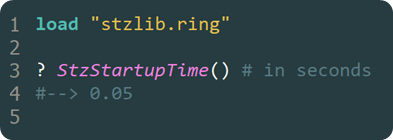

# Softanza Startup Time: How Ring Loads a 300K Line Library in only 0.05 Seconds!

This morning, I added the `StzStartupTime()` function to the Softanza library and was pleased to find that it took just **0.05 seconds** to load the entire library. Intrigued by how this performance compares to other languages, I asked ChatGPT for a detailed analysis. The result is an interesting comparison that shows how **Ring** outperforms many other languages in terms of startup time, especially considering it’s an interpreted language.

Let’s break it down with a table that clearly shows the startup times for different languages, followed by a deeper dive into the insights:

## Startup Time Comparison Table

| **Language**           | **Startup Time**                | **Characteristics**                                                                                               |
|------------------------|---------------------------------|--------------------------------------------------------------------------------------------------------------------|
| **Ring (Softanza)**     | **0.05 seconds**                | Exceptionally fast startup, loading 300,000 lines of code in a fraction of a second. Ideal for performance-sensitive applications. |
| **Python**              | **0.1 to 1 second**             | Startup time varies with code size and libraries. Larger codebases result in longer load times.                   |
| **Ruby**                | **0.1 to 1 second**             | Similar to Python, startup time can reach 1 second, especially for applications with multiple dependencies.        |
| **PHP**                 | **0.1 to 1 second**             | PHP is typically faster than Python and Ruby in small scripts but lags behind for more complex applications.       |
| **.NET Core**           | **0.5 to 2 seconds**            | Larger ASP.NET applications take longer to start due to the need to compile and load various libraries.            |
| **Wolfram Language**    | **1 to 3 seconds**              | Wolfram has a slower startup, largely due to its extensive set of libraries and features.                          |
| **Julia**               | **0.1 to 0.5 seconds**          | Julia’s startup can be fast but may take longer on the first run due to JIT compilation.                          |

## Key Insights from the Comparison

1. **Ring**: 
   - At **0.05 seconds**, Ring’s performance is extremely efficient, even for a large codebase like Softanza’s 300,000 lines of code. This is an exceptional result, particularly when compared to other interpreted languages. The key takeaway is that Ring can offer lightning-fast startup times, which is valuable for applications that require minimal load time and high responsiveness.

2. **Python**: 
   - Python’s startup time generally ranges between **0.1 to 1 second** depending on the size and complexity of the libraries being loaded. While Python’s simplicity and widespread use make it a go-to for many developers, its startup speed isn’t as fast as Ring’s. For applications that rely heavily on rapid startup times, this is something to keep in mind.

3. **Ruby**:
   - Ruby is similar to Python in terms of performance, with startup times ranging from **0.1 to 1 second**. Ruby’s interpreted nature means it also faces a tradeoff in terms of startup efficiency. Larger applications can experience delays, which can impact the overall user experience, especially if the application is designed to be deployed rapidly.

4. **PHP**: 
   - PHP typically starts a little faster than Python and Ruby, but still, it can take **0.1 to 1 second** for more complex applications. While PHP’s speed in small scripts is often good, it doesn’t perform as well for larger codebases. Its advantage mainly lies in web server environments where the application is already loaded into memory.

5. **.NET Core**: 
   - .NET Core, especially in the context of **ASP.NET** applications, takes **0.5 to 2 seconds** to start. This is a noticeable gap compared to Ring’s **0.05 seconds**. While .NET Core’s compiled nature offers performance benefits during runtime, the initial startup requires more time due to JIT compilation and the loading of various libraries. This makes Ring a more attractive option when startup speed is critical.

6. **Wolfram Language**: 
   - The Wolfram Language is known for its rich set of libraries and features, but this comes at the cost of startup speed. It takes between **1 and 3 seconds** to load, which is quite a bit slower than Ring. If you're working in an environment where computational speed and startup time are important, Wolfram may not be the best choice in terms of startup efficiency.

7. **Julia**: 
   - Julia’s startup time ranges from **0.1 to 0.5 seconds**, which places it in a similar bracket as Python and Ruby but with some advantage for smaller codebases. However, the **first run** can be slower due to JIT compilation, although subsequent runs will be faster. While Julia is a powerful language for high-performance computing, Ring’s **0.05-second startup** is still a noteworthy advantage.

## Why This Matters

Startup time of a library like Softanza is critical for certain applications, especially those where responsiveness and speed are prioritized (web apps, reactive UIs, apss running on constrained devices, etc.).

From this comparison, **Ring** clearly stands out for its **minimal startup time**. For large-scale applications where speed is essential from the very first execution, Ring’s efficiency in handling more then 300,000 lines of code (in the Softanza codebase) in just **0.05 seconds** offers a significant advantage over other popular languages, including those with compiled or intermediate runtimes like **.NET Core** and **Wolfram**.

In conclusion, Ring’s startup performance positions it as a strong contender for projects where **time-to-execution** is a critical factor, ensuring that applications built with Softanza can benefit from rapid initialization without sacrificing functionality.