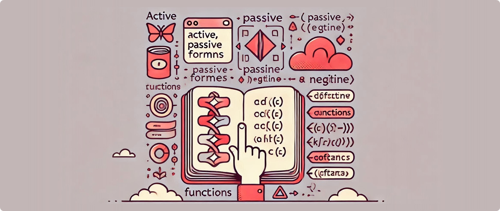

#Active, Passive, and Negative Forms in Softanza: A Linguistic Approach to Programming


Softanza, the foundation library for the Ring programming language, brings a unique feature set that mirrors natural language constructs. By treating functions as linguistic expressions, Softanza enables developers to write expressive, readable, and intuitive code. At the heart of this design are **active**, **passive**, and **negative forms** of functions. This article explores these forms, beginning with their analogy to natural language and progressing through practical examples.

---

## Active Form: Functions as Verbs  
In Softanza, all functions are expressed by defaul in their active form. This so called `@FunctionActiveFrom` is always a **verb** that **acts** directly on the object it is called upon. Much like verbs in natural language, active functions perform an action **in place**, modifying the state of the object.  

**Example of a @FunctionActiveForm**

Consider the following string manipulation:  

```ring
o1 = new stzString("RIxxNxG")
o1.Remove("x")  # Removes all "x" characters from the object's content
? o1.Content()
#--> RING
```  

Here, the function `Remove()` actively modifies the content of the object `o1`, just as the verb "remove" would imply an action in real life.  

---

## Passive Form: Actions Without Side Effects  
In some scenarios, you may want to perform an action without altering the original object. This is where the `@FunctionPassiveForm` comes into play. Linguistically, the passive form shifts the focus **from the actor** (the object) **to the result** of the action.  

In programming terms, the passive form of a function returns a **new value** that reflects the desired transformation, leaving the original object unchanged.  

**Example: Passive Form**
Let’s revisit the string manipulation, but this time using the passive form:  

```ring
o1 = new stzString("RIxxNxG")
? o1.Removed("x")  # Returns a copy of the string with "x" removed
#--> RING

? o1.Content()  # The original object remains unchanged
#--> RIxxNxG
```  

The function `Removed()` produces a new string without modifying the content of `o1`. This distinction ensures clarity and reduces the risk of unintentional side effects in your code.

> **Note**: Internally, a copy of o1 has been created (using `o1.Copy()`) and then an active `Remove()` has been acted on it, before the content of the copy is returned (using `Copy.Content()`).

---

##Negative Form: Simplifying Logical Negations 

Softanza also supports a **negative form** for certain functions, designed to make logical negations more natural and intuitive. Instead of writing verbose boolean expressions, you can directly call the negative form of a function, much like using "not" in natural language.  

**Example: Negative Form**

Here’s how you might check if a character is **not** a letter using the standard computational approach:  

```ring
? NOT Q("*").IsLetter()
```  

Softanza simplifies this by introducing a direct negative form:  

```ring
? Q("*").IsNotLetter()
```  

This functionality, called **@FunctionNegativeForm**, enhances code readability by allowing developers to express negation as naturally as they would in spoken language.

> **Note**: Not all functions in Softanza currently have a negative form, but support for this feature will expand in future updates.  

---

##Why These Forms Matter  

Softanza’s distinction between active, passive, and negative forms is more than a stylistic choice—it offers practical benefits:  

1. **Linguistic Clarity**:  
   - Active functions act on objects directly, like verbs in a sentence.  
   - Passive functions describe a state or result, akin to the passive voice in language.  
   - Negative forms streamline logical expressions by mirroring natural negation.  

2. **Enhanced Readability**:  
   - Code becomes easier to read and understand, especially for new developers.  

3. **Greater Flexibility**:  
   - Developers can choose the most appropriate form for their use case, whether to modify objects in place or preserve their original state.  

4. **Reduced Errors**:  
   - The clear distinction between active and passive forms prevents accidental side effects, while the negative form avoids verbose logical expressions.

---

##Conclusion  
Softanza’s active, passive, and negative function forms exemplify its commitment to intuitive, natural language-inspired programming. By aligning function names and behaviors with linguistic patterns, Softanza simplifies code writing, enhances clarity, and empowers developers with greater control.  

As Softanza evolves, expanded support for these forms will further its mission of making programming as natural as thinking. Whether you’re modifying an object, creating a new one, or simplifying logical conditions, Softanza has you covered with its versatile and expressive design.