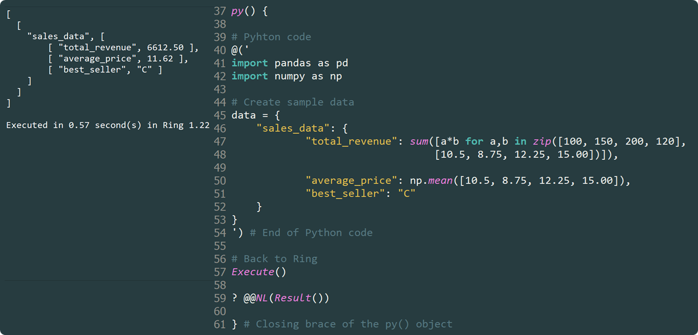

# Expanding Ring’s Horizons: Unlocking New Possibilities with Python

The Ring programming language, on which Softanza is built, is known for its simplicity and innovative capabilities. Now, Ring has taken a significant leap forward with the introduction of **py()**, a powerful feature from the Softanza library.

This innovation **breaks the isolation of Ring**, seamlessly integrating it with **Python**, the world’s most widely used programming language. By enabling direct execution of Python code within Ring, `py()` unlocks new possibilities for data analytics, machine learning, and professional software development—without requiring C or C++ extensions.

> NOTE: Python must be installed and accessible from the system PATH.

## A Simple Yet Powerful Design

At its core, `py()` is an instance of the `stzPyCode` class, which inherits from `stzExtCodeXT`—a general class designed to support multiple external languages with minimal configuration. This means that **Softanza is paving the way for future expansions**, allowing other programming languages to be embedded within Ring easily.

The elegance of `py()` lies in its simplicity:

```ring
py() {
    # The Python code is provided as a string to @() like this:
    @('res = {"numbers": [1, 2, 3, 4, 5], "mean": sum([1, 2, 3, 4, 5]) / 5}')

    # Execute the Python code
    Execute()

    # Retrieve the result in Ring
    ? @@(Result())
    #--> [ [ "numbers", [ 1, 2, 3, 4, 5 ] ], [ "mean", 3 ] ]
}
```

This snippet executes a small Python script, calculates the mean of a list of numbers, and seamlessly returns the result to Ring as a **well-formed list data type**.

> NOTE: As you see in the Pyhton code, the result variable name must be is`res`. This is configurable within the class and you can change it by modifying the `@cResultVar` attribute to any name you prefer.

## Beyond Basic Computation: Real-World Applications

The true power of `py()` shines when integrating complex Python libraries such as **Pandas**, **NumPy**, and **scikit-learn** within Ring programs. This removes the need to wait for specialized libraries to be implemented natively in Ring and instead **leverages Python’s rich ecosystem instantly**.

> NOTE: The following examples require the `pandas`, `numpy`, and `scikit-learn` modules. Ensure they are installed on top of Python before running the code.

### Data Analysis with Pandas

Consider a scenario where a Ring application needs to process sales data. With `py()`, it’s straightforward:

```ring
py() {
@('import pandas as pd
import numpy as np

res = {
    "sales_data": {
        "total_revenue": sum([a*b for a,b in zip([100, 150, 200, 120], [10.5, 8.75, 12.25, 15.00])]),
        "average_price": np.mean([10.5, 8.75, 12.25, 15.00]),
        "best_seller": "C"
    }
}')

Execute()
? @@(Result())
}
```

Result:

```
[
    [
        "sales_data",
        [
            [ "total_revenue", 6612.50 ],
            [ "average_price", 11.62 ],
            [ "best_seller", "C" ]
        ]
    ]
]
```

### Text Processing and Natural Language Analysis

Python’s regex engine and collections module allow efficient text processing inside Ring:

```ring
py() {
@('from collections import Counter
import re

text = """
Ring is an innovative programming language that can embed Python code.
This makes Ring more powerful and flexible for developers who need
both Ring and Python capabilities in their applications.
"""

res = {
    "text_analysis": {
        "word_count": len(text.split()),
        "char_count": len(text),
        "word_frequency": dict(Counter(re.findall(r"\w+", text.lower()))),
        "sentences": len(re.split(r"[.!?]+", text))
    }
}')

Execute()
? @@(Result())
}
```

Result:

```
[
    [ "text_analysis",
        [
            [ "word_count", 30 ],
            [ "char_count", 195 ],
            [ "word_frequency",
                [ [ "ring", 3 ], [ "python", 2 ], [ "and", 2 ], [ "is", 1 ], ... ]
            ],
            [ "sentences", 3 ]
        ]
    ]
]
```

### Machine Learning with Scikit-Learn

One of the most exciting applications of `py()` is its ability to integrate with **machine learning** frameworks. Here’s an example using **scikit-learn** to train a classification model inside Ring:

```ring
py() {
@('from sklearn.datasets import make_classification
from sklearn.model_selection import train_test_split
from sklearn.ensemble import RandomForestClassifier

X, y = make_classification(n_samples=100, n_features=4, random_state=42)
X_train, X_test, y_train, y_test = train_test_split(X, y, test_size=0.2)

clf = RandomForestClassifier(random_state=42)
clf.fit(X_train, y_train)

res = {
    "accuracy": clf.score(X_test, y_test),
    "feature_importance": clf.feature_importances_.tolist(),
    "predictions": clf.predict(X_test).tolist()
}')

Execute()
? @@(Result())
}
```

Result:

```
[
    [ "accuracy", 0.90 ],
    [ "feature_importance", [ 0.03, 0.09, 0.33, 0.55 ] ],
    [ "predictions", [ 0, 0, 0, 0, 1, 1, 0, 0, 1, 1, 0, 0, 1, 1, 1, 1, 0, 0, 0, 0 ] ]
]
```

## A Glimpse into `py()` in Ring NotePad

Here’s a live example from my Ring NotePad session, showcasing one of the cases discussed earlier:



Seamless execution with good performance—power and efficiency combined!


## Why This Innovation Matters

* **Expanding Ring’s capabilities**: With Softanza **py()**, Ring is no longer limited by its young ecosystem. It can instantly access thousands of Python libraries for data science, AI, and more.
* **Boosting professional adoption**: Enterprises, research labs, and universities can now consider Ring and the Softanza platform for serious applications without worrying about missing tools.
* **Future-proofing the language**: Since `stzExtCodeXT` is designed for multi-language support, future versions of Softanza could integrate other languages like Mojo, JavaScript, R, or even Rust, C#, and Go with minimal effort.

For me, as Softanza’s designer, I introduced this feature to meet the needs of my first customer, who required data analytics, machine learning, and advanced statistics for his restaurant management platform. **py()** solved my problem, allowing me to iterate quickly with my customer without investing excessive time in developing C or C++ extensions.

## A Game-Changer for the Ring Ecosystem

With **py()**, Softanza has achieved what many emerging languages struggle with—**breaking isolation**. By allowing Ring programs to embed and execute Python code effortlessly, it **brings Ring into the professional software development space**. Whether for **data analytics, text processing, or AI**, **Ring now has access to one of the most powerful toolsets available today**.
