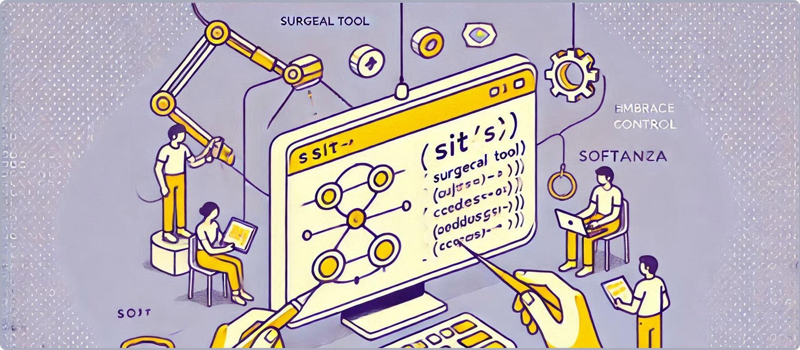

# Mastering Precision with the `Sit()` Function



The `Sit()` function stands out as a **surgical tool** for precision string manipulation. Whether you’re designing advanced text editors, processing linguistic data, or debugging complex parsers, `Sit()` adapts to your needs with unparalleled flexibility. Embrace the control it offers and elevate your string manipulation game with Softanza!

Let’s explore practical examples where `Sit()` excels.

---

## Example 1: Extract Variable Contexts for Text Highlighting

Imagine building a **text editor** with a live preview that highlights words with their surrounding context. The goal is to extract a substring like `"nice"` and dynamically include **2 characters before and 3 characters after**:

```ring
load "stzlib.ring"

o1 = new stzString("what a <<nice>>> day!")

? o1.Sit(
	:OnSection  = o1.FindAsSection("nice"),
	:AndHarvest = [ :NCharsBefore = 2, :NCharsAfter = 3 ]
)
#--> [ "<<", ">>>" ]
```

Here’s why `Sit()` is invaluable:
- The number of surrounding characters is not tied to a fixed pattern but is defined based on **contextual needs**—ideal for previews or summaries.
- Alternative methods like `SubStringBounds()` are rigid, extracting only exact bounds.


## Example 2: Position-Based Extraction for Advanced Tokenization

Suppose you’re tokenizing a sentence and want to dynamically extract **letters surrounding a given character** (like `"i"` in `"nice"`) to analyze its immediate context, for tasks such as **natural language processing (NLP)** or **spell checking**.

```ring
o1 = new stzString("what a <<nice>>> day!")

? o1.Sit(
	:OnPosition = 11, # the letter "i"
	:AndHarvest = [ :NCharsBefore = 1, :NCharsAfter = 2 ]
)
#--> [ "n", "ce" ]
```

This showcases `Sit()`’s precision:
- Anchors the operation to a **specific position**.
- Dynamically harvests a **customizable range** around the anchor.


## Example 3: Extracting Overlapping Contexts for Deep Inspection

For debugging, you might need to inspect **overlapping contexts** around a substring (like `"nice"`) and capture the **boundaries of its surroundings**. Instead of a static range, you define exactly how far before and after to look.

```ring
o1 = new stzString("what a <<nice>>> day!")

? @@( o1.Sit(
	:OnSection  = o1.FindAsSection("nice"),
	:AndHarvestSections = [ :NCharsBefore = 2, :NCharsAfter = 3 ]
) )
#--> [ [8, 9], [14, 16] ]
```

Here, `Sit()` extracts **surrounding section boundaries** with custom offsets:
- Surrounding ranges (`[8, 9]` and `[14, 16]`) dynamically depend on your `NCharsBefore` and `NCharsAfter` parameters.
- This level of granularity is crucial for debugging parsers or **extracting overlapping segments** in structured text.

>**NOTE**: `**@@**(val)` used above, is a Softanza small function, akin to a **pair of glasses** that enhance vision, designed to produce a readable string representation of any value `val`, especially when `val` is a list.

---

## Conclusion

The `Sit()` function’s strength lies in:
1. **Manual control over context size:** Specify how many characters before and after to include—perfect for dynamic, context-sensitive tasks.
2. **Support for flexible anchors:** Work with positions, sections, or dynamically found substrings.
3. **Versatile harvesting:** Extract content, section bounds, or both.


